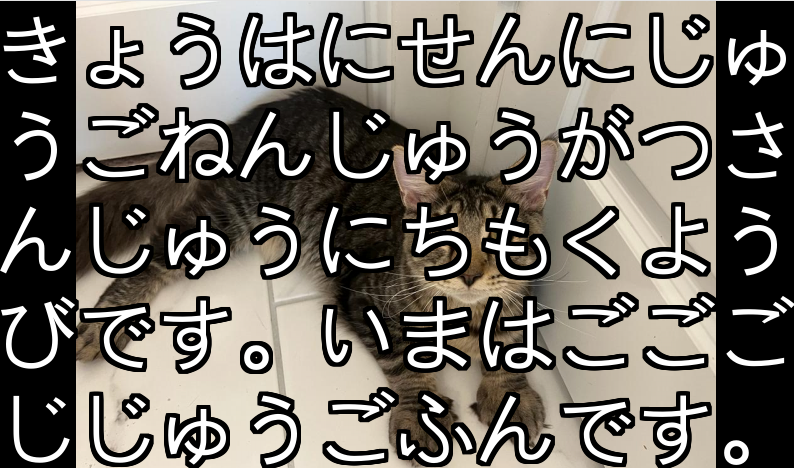

# japanese_hiragana_watch

I have created this small application to put it in a Raspberry Pi and help my Japanese learning curve. It shows the date and the time in hiragana.
If configured, it creates a slideshow of the photos you drop on a specific directory.

# To make it work on a Raspberry Pi

1. Open a terminal on your Raspberry Pi.

2. Edit the locale configuration file:
```sudo nano /etc/locale.gen```

3. Find the line that says `# ja_JP.UTF-8 UTF-8` and uncomment it by removing the `#` at the beginning of the line.

4. Save the file and exit the editor (in nano, press Ctrl+X, then Y, then Enter).

5. Generate the new locale:
```sudo locale-gen```

6. Update the locale settings:
```sudo update-locale```

7. Install pygame and Japanese truetype font
```sudo apt-get install python3-pygame fonts-horai-umefont ```

8. Reboot your Raspberry Pi:
```sudo reboot```

9. Adjust `config.ini` by setting the right options for Raspberry Pi (and slide show if you want). For the slideshow, make sure to copy your photos in the directory you configure in `config.ini`. Please note that both horizontal and traditional vertical orientation of the text are supported.

10. Run the script:
```./japanese_hiragana_watch.py```

*NOTE*: If you are curious, this application generates a log file named `watch.log` in the same directory is launched.

To exit use the `Esc` key or `Ctrl+C`

# iCloud Photo Sync (Experimental - Limited Compatibility)

**⚠️ Note:** This feature is experimental and has known compatibility issues with certain Apple account configurations, particularly Apple IDs using third-party email addresses (Gmail, Hotmail, etc.). Manual photo export is recommended for most users.

If you want to automatically sync photos from your iCloud Photos library to your watch, you can use the companion `experimental/icloud_photo_sync.py` script. This script runs on Linux (Fedora or Raspberry Pi OS) and downloads photos directly from iCloud.

## Known Limitations

- May not work with Apple IDs using non-Apple email addresses (Hotmail, Gmail, etc.)
- Requires 2FA to be enabled
- Authentication may fail depending on account security settings
- If you encounter authentication issues, manual photo export is recommended

## Prerequisites

1. Install the `pyicloud` library:
   ```bash
   pip install pyicloud
   ```

2. Generate an **app-specific password** for iCloud:
   - Go to https://appleid.apple.com/
   - Sign in with your Apple ID
   - Navigate to "Security" → "App-Specific Passwords"
   - Generate a new password and save it

## Configuration

1. Edit `config.ini` and add your iCloud credentials in the `[iCloud]` section:
   ```ini
   [iCloud]
   username = your_email@icloud.com
   password = your_app_specific_password
   ```

   **IMPORTANT:** Use the app-specific password you generated, NOT your main iCloud password.

## Usage

### Download All Photos (limited to 50 by default)
```bash
python3 experimental/icloud_photo_sync.py
```

### Download Only Favorite Photos
```bash
python3 experimental/icloud_photo_sync.py --favorites-only
```

### Download from a Specific Album
```bash
python3 experimental/icloud_photo_sync.py --album "Vacation 2024"
```

### Download More Photos
```bash
python3 experimental/icloud_photo_sync.py --max-photos 100
```

### Combine Options
```bash
python3 experimental/icloud_photo_sync.py --favorites-only --max-photos 200
```

## First Run - Two-Factor Authentication

The first time you run the script, you'll need to complete two-factor authentication:

1. Run the script
2. You'll receive a verification code on your trusted Apple devices
3. Enter the code when prompted
4. The authentication will be saved for future runs (typically valid for 2 months)

## Automated Sync

To automatically sync photos periodically, you can set up a cron job:

```bash
# Edit your crontab
crontab -e

# Add this line to sync photos daily at 3 AM
0 3 * * * cd /path/to/japanese_hiragana_watch && python3 experimental/icloud_photo_sync.py --favorites-only

# Or sync every 6 hours
0 */6 * * * cd /path/to/japanese_hiragana_watch && python3 experimental/icloud_photo_sync.py --favorites-only
```

## Troubleshooting

- **Authentication fails:** Make sure you're using an app-specific password, not your regular iCloud password
- **No favorites found:** The script will list all available albums. Check the album names and use `--album` to specify the correct one
- **Photos already exist:** The script skips photos that already exist in your photos directory
- **Sync log:** Check `icloud_sync.log` for detailed information about sync operations
